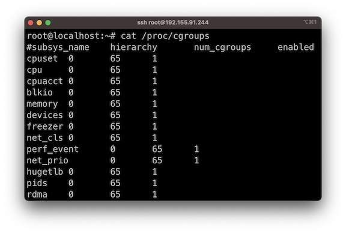
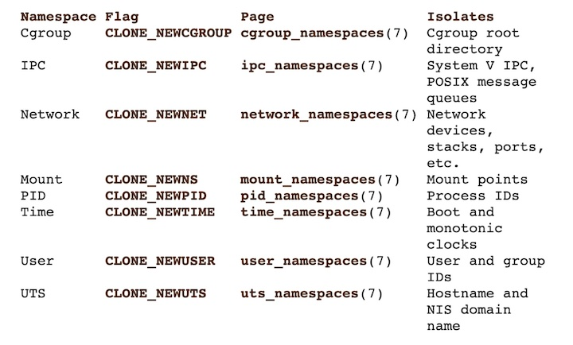
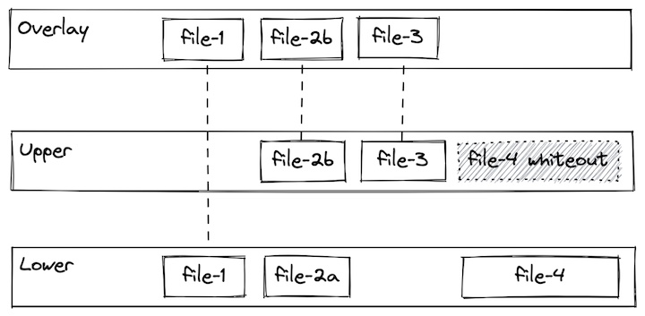
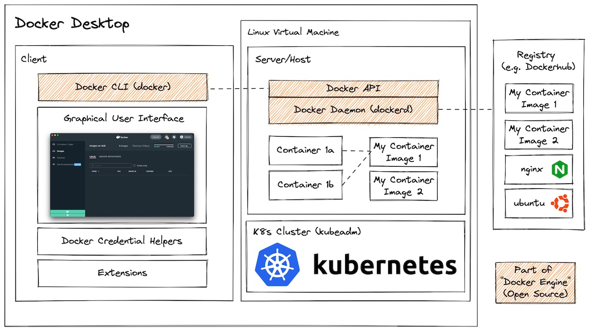

| [History and Motivation](../01-history/history.md)
| [Technology Overview](./02-tech-overview/tech-overview.md)
| [Installation and Set Up](../03-installations/setup.md)
| [Using 3rd Party Containers](../04-using-3rd-party-containers/README.md)
| [Example Web Application](../05-example-web-application/README.md)
| [Building Container Images](../06-building-container-images/README.md)
| [Container Registries](../07-container-registries/README.md)
| [Running Containers](../08-running-containers/README.md)
| [Container Security](../09-container-security/README.md)
| [Interacting with Docker Objects](../10-interacting-with-docker-objects/README.md)
| [Development Workflows](../11-development-workflow/README.md)
| [Deploying Containers](../12-deploying-containers/README.md)

---

# Technology Overview

<!-- no toc -->
- [Linux Building Blocks](#linux-building-blocks)
  - [Cgroups](#cgroups)
  - [Namespaces](#namespaces)
  - [Union filesystems](#union-filesystems)
- [Docker Application Architecture](#docker-application-architecture)

## Linux Building Blocks

Containers leverage linux kernel features cgroups and namespaces to provide resource constraints and application isolation respectively. They also use an union filesystem that enables images to be built upon common layers, making building and sharing images fast and efficient.

***Note:*** Docker did not invent containers. For example, LXC containers (https://linuxcontainers.org/) was implemented in 2008, five years before Docker launched. That being said, Docker made huge strides in developer experience, which helped container technologies gain mass adoption and remains one the most popular containerization platforms.

---

### Cgroups

Cgroups are a Linux kernel feature which allow processes to be organized into hierarchical groups whose usage of various types of resources can then be limited and monitored.

With cgroups, a container runtime is able to specify that a container should be able to use (for example):
* Use up to XX% of CPU cycles (cpu.shares)
* Use up to YY MB Memory (memory.limit_in_bytes)
* Throttle reads to ZZ MB/s (blkio.throttle.read_bps_device)

- In Linux, **cgroups** (control groups) are kernel features that acts as a "resource manager" for processes. While **namespaces** isolate what process can see (like its own file system or network), cgroups isolate what a process can use (like CPU and RAM).

- Docker uses cgroups to ensure that one container dosen't starve others by hogging all the host's resources - a problem often referred as **noisy neighbor**.

- Resource Limiting: Docker sets hard limits on resources like memory (--memory) and CPU (--cpus). If a container tries to use more than its limit, the kernel will either throttle its performance or terminate it (OOM kill (out of memory)).

- Prioritization: You can give specific containers a larger share of CPU cycles or disk I/O when the system is busy, ensuring critical apps stay fast.

- Accounting: Cgroups track exactly how much memory and CPU every container is using. This data powers tools like docker stats.

- Process Control: Cgroups allow Docker to "freeze" a container (pausing all its processes at once) or prevent "fork bombs" by limiting the total number of processes a container can spawn. 

---

### Namespaces 

A namespace wraps a global system resource in an abstraction that makes it appear to the processes within the namespace that they have their own isolated instance of the global resource. 

Changes to the global resource are visible to other processes that are members of the namespace, but are invisible to other processes.

With namespaces, a container runtime is able to keep processes outside of the container invisible within the container or map the user inside the container to a different user on the host (among other things).

 

- In Docker, namespaces are a Linux kernel features that provide the primary layer of isolation for containers by partitioning system resources. They effectively limit what a process can **see** and interact with, making a container feel like a standalone virtual machine while it actually runs a standard process sharing the host's kernel.

- When we run a container, Docker creates a set of namespaces that isolate the following core resources:

#### Core Types of Namespaces :

- **zPID (Process ID)** : Isolates the process ID space. Inside the container, the first process (like Nginx) is assigned PID 1, which treats the container like its own init system. This process cannot see or signal processes running in other namespaces or on the host.

- **NET (Network)** : Provides an independent network stack for each container, including its own IP addresses, routing tables, and firewall rules. This allows multiple containers to run services on the same port (e.g., port 80) without conflicts.

- **MNT (Mount)** : Isolates filesystem mount points, ensuring a container has its own view of the filesystem. A container cannot see or modify the host's files unless they are explicitly shared via volumes.

- **UTS (UNIX Time-Sharing)** : Allows each container to have its own unique hostname and NIS domain name, independent of the host system.

- **IPC (Inter-Process Communication)** : Prevents processes in different containers from accessing each other's shared memory segments or message queues.

- **USER (User ID)** : Maps container-specific user and group IDs to different IDs on the host. This allows a process to have root privileges (UID 0) inside a container without actually being root on the host system, significantly improving security.

- **Cgroup** : Isolates the view of control groups (cgroups), preventing a container from seeing the resource usage or limits of other containers.

- **Time** : A newer addition that allows containers to have their own system time settings (like monotonic and boot time) without affecting the host clock. 

Namespaces vs. Cgroups :
- While namespaces control visibility (what a process can see), Control Groups (cgroups) control resource limits (how much CPU, RAM, or I/O a process can use). Together, they form the foundation of container technology

---

### Union filesystems

A union filesystem allows files and directories of separate file systems, known as branches, to be transparently overlaid, forming a single coherent file system. 

Contents of directories which have the same path within the merged branches will be seen together in a single merged directory, within the new, virtual filesystem.

This approach allows for efficient use of space because common layers can be shared. For example, if multiple containers from the same image are created on a single host, the container runtime only has to allocate a thin overlay specific to each container, while the underlying image layers can be shared. More detail on understanding the implications of these filesystem on data persistence can be found in 04-using-3rd-party-containers.

 

---

## Docker Application Architecture

It is useful to break down the various components within the Docker ecosystem. The first distinction to make is between "Docker Desktop" and "Docker Engine".

Docker Desktop is an application you install on development systems that provides:
- A client application:
  - Docker CLI (command line interface for interacting with Docker)
  - GUI for configuring various system settings
  - Credential helpers for accessing registries
  - Extensions (3rd party plugins)
- A Linux virtual machine containing:
  - Docker daemon (dockerd), exposing the Docker API
  - (Optional) Kubernetes cluster

Docker Desktop is free for personal use, but requires a subscription for [certain commercial use cases](https://www.docker.com/pricing/faq/).

Docker Engine refers to a subset of those component which are free and open source and can be installed only on Linux. Specifically Docker Engine includes:
- Docker CLI
- Docker daemon (dockerd), exposing the Docker API

Docker Engine can build container images, run containers from them, and generally do most things that Docker Desktop but is Linux only and doesn't provide all of the developer experience polish that Docker Desktop provides.

Container image registries are not part of Docker itself, but because they are the primary mechanism for storing and sharing container images it is worth including it here. Docker runs a registry named DockerHub, but there are many other registries as well. More info on these can be found in `07-container-registries`.

