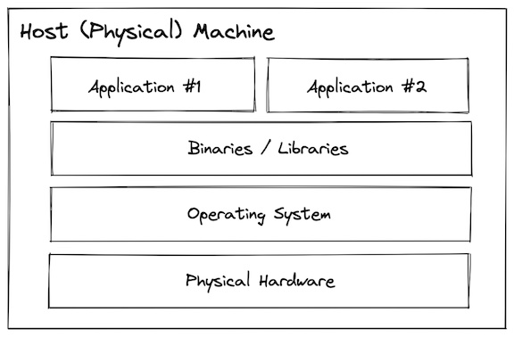
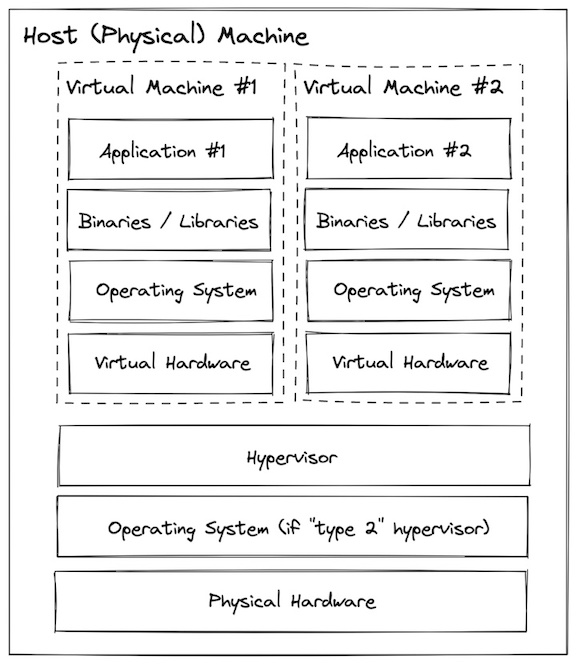
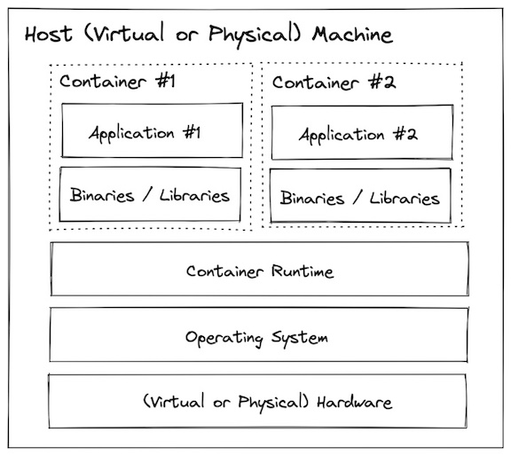
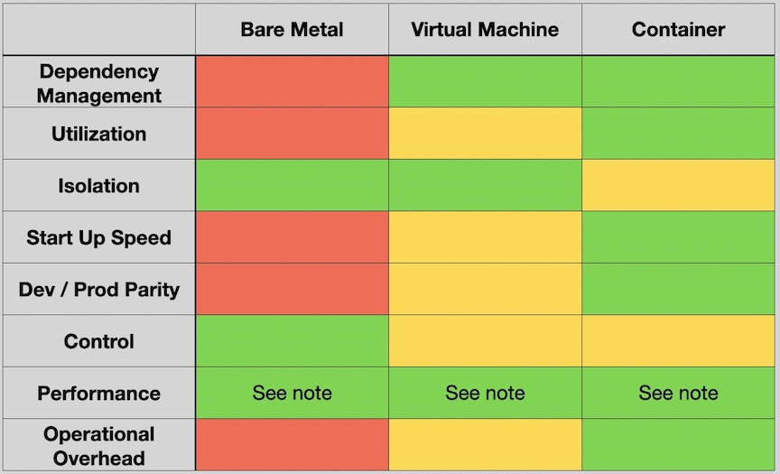

| [History and Motivation](../01-history/README.md)
| [Technology Overview](../02-tech-overview/README.md)
| [Installation and Set Up](../03-installations/README.md)
| [Using 3rd Party Containers](../04-3rd-party-containers/README.md)
| [Example Web Application](../05-web-app/README.md)
| [Building Container Images](../06-container-image/README.md)
| [Container Registries](../07-container-registries/README.md)
| [Running Containers](../08-running-containers/README.md)
| [Container Security](../09-container-security/README.md)
| [Interacting with Docker Objects](../10-docker-objects/README.md)
| [Development Workflows](../11-development-workflow/README.md)
| [Deploying Containers](../12-deploying-containers/README.md)

---

# History and Motivation

<!-- no toc -->
  - [What is a container?](#what-is-a-container)
  - [History of virtualization](#history-of-virtualization)
    - [Bare Metal](#bare-metal)
    - [Virtual Machines](#virtual-machines)
    - [Containers](#containers)
    - [Tradeoffs](#tradeoffs)

---

## What is a container?

A Docker container image is a lightweight, standalone, executable package of software that includes everything needed to run an application, , including the code, runtime, system tools, libraries, and settings. (https://www.docker.com/resources/what-container/).

## History of virtualization

### Bare Metal

Before virtualization was invented, all programs ran directly on the host system. The terminology many people use for this is "bare metal". While that sounds fancy and scary, you are almost certainly familiar with running on bare metal because that is what you do whenever you install a program onto your laptop/desktop computer. 

Running on bare metal refers to installing an operating system or application directly on physical hardware, without an intermediate virtualization layer, hypervisor, or guest OS.
(This provides maximum performance, full hardware control, and dedicated resources for high-intensity tasks like databases and AI/ML).

With a bare metal system, the operating system, binaries/libraries, and applications are installed and run directly onto the physical hardware.

Libraries/Binaries are two fundamental forms of compiled software code. Binaries are executable programs designed to run directly on the CPU.

Binaries (Executable Files): Designed for execution and often user-facing, such as command-line tools or desktop applications. They have a main function as an entry point.

Libraries (Modules/Packages): Designed for reusability, allowing developers to share code across multiple projects. Examples include graphics libraries (OpenGL) or dynamic link libraries (.dll, .so).

This is simple to understand and direct access to the hardware can be useful for specific configuration, but can lead to:
- Hellish dependency conflicts
- Low utilization efficiency
- Large blast radius
- Slow start up & shut down speed (minutes)
- Very slow provisioning & decommissioning (hours to days)

**Dependency hell** occurs when software projects are overwhelmed by conflicting version requirements for libraries, leading to build failures, runtime errors, or broken functionality. It often happens when different dependencies require incompatible versions of the same, third-party package (e.g., Package A needs v1.0, Package B needs v2.0).

**Low utilization efficiency** refers to a scenario where resources—such as labor, machinery, or capital—are not being used to their maximum potential output. It signifies a gap between what is produced and what could be produced, often leading to wasted capacity, increased costs per unit, and reduced profitability.

**Large blast radius** refers to the extensive, widespread damage caused by a single failure, bug, or security breach. It measures how far a negative impact propagates, where one minor change or vulnerability can bring down entire systems, impact most users, or expose vast amounts of data. 

---

### Virtual Machines

A Virtual Machine (VM) is a software-based, isolated emulation of a physical computer that runs its own operating system and applications, sharing resources from a physical "host" machine. They enable running multiple OS environments (e.g., Linux on Windows) on one device, offering, flexibility, cost savings, and security. 

Virtual machines use a system called a "hypervisor" that can carve up the host resources into multiple isolated virtual hardware configuration which you can then treat as their own systems (each with an OS, binaries/libraries, and applications).

**HYPERVISOR / VIRTUAL MACHINE MONITOR** - is a software that creates and runs virtual machines (VMs) by seperating a physical machine's software from its hardware. It allows a single physical "host" machine to run multiple, independent "guest" operating systems simultaneously by pooling and distributing resources like CPU, memory, and storage. 

This helps improve upon some of the challenges presented by bare metal:

- No dependency conflicts
- Better utilization efficiency
- Small blast radius
- Faster startup and shutdown (minutes)
- Faster provisioning & decommissioning (minutes)

---

### Containers

Containers are similar to virtual machines in that they provide an isolated environment for installing and configuring binaries/libraries, but rather than virtualizing at the hardware layer containers use native linux features (cgroups + namespaces) to provide that isolation while still sharing the same kernel.

**Virtual Machine** (The House) foundation (its own full OS). 
- And this would be HEAVY cuz it needs its own infrastructure, it takes up a lot of space and resources. 
- And this is Private, very secure as it dosen't share anything with the neighbours.

**Containers** (The Apartment) - a container is like an apartment inside a building.
- It has shared infrastructure, all apartments share the same main plumbing and electrical lines (the linux kernel).
- It is lightweight, because we are not building a new foundation for every room, we can fit many more apartments in the same space.
- Isolated Rooms, Even though they share the building's "bones" we still have our own front door and walls (cgroups and namespaces). We can't see into our neighbour's unit, and they can't use your kitchen.

In short : VMs package the entire "house" (the OS), while containers just package the "furniture and people" (your app and libraries) and plug into the existing building.

This approach results in containers being more "lightweight" than virtual machines, but not providing the same level of isolation:

- No dependency conflicts
- Even better utilization efficiency
- Small blast radius
- Even faster startup and shutdown (seconds)
- Even faster provisioning & decommissioning (seconds)
- Lightweight enough to use in development!

---

### Tradeoffs

***Note:*** There is much more nuance to “performance” than this chart can capture. A VM or container doesn’t inherently sacrifice much performance relative to the bare metal it runs on, but being able to have more control over things like connected storage, physical proximity of the system relative to others it communicates with, specific hardware accelerators, etc… do enable performance tuning.