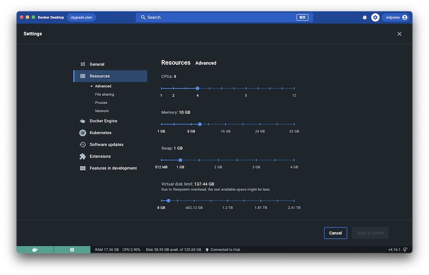

---
# Installation and Set Up

We need this - Docker Desktop: https://docs.docker.com/get-docker/

Docker Engine: https://get.docker.com/
---

## Configuring Docker Desktop

The default settings are likely fine for getting started, but if you begin to run more intensive applications, you may want to adjust the resources available to Docker. This can be done within the settings panel in the GUI.

<!--  -->

---

## Running First Container

Hello World:

```
docker run hello-world
```

Dockerfile for java

```dockerfile
# pulls a base image which gives all required tools and libraries
FROM openjdk:17-jdk-alpine

# create a folder where the app code will be stored
WORKDIR /app

# copy the source code from HOST machine to the container
COPY . .
or
COPY src/Main.java /app/Main.java

# compile the application code
RUN javac Main.java

# run the application
CMD ["java", "Main"]
```

```cmd
docker build -t java-app .

docker run java-app
```

Dockerfile for python

```dockerfile
FROM python:3.7

WORKDIR /app

COPY . .

RUN pip install -r requirements.txt

ENTRYPOINT ["python", "run.py"]
```

---

---

## DOCKER MERN

1. Frontend (React + Vite)
2. Backend (Node + Express)
3. Database (MongoDB)

- Docker becomes valuable when you stop thinking about "running code" and start thinking about "running services".

1. Why is Docker useful for your MERN project?

- Imagine you give your project to another developer.
  Without Docker:

```
git clone project

# install node
# install npm
# install mongodb
# install correct mongodb version
# setup .env
# npm install frontend
# npm install backend
# start mongodb
# start backend
# start frontend
```

With this we hear:
"Bro it's **not** working on my machine."

- Docker solves this. Instead, the developer runs:

```
docker compose up
// Everything starts.
```

---

### Docker gives :

### 1. Consistent Environment

- We develop on:
  _Node 22 Mongo 8 npm 10_

- Another developer might have:
  _Node 18 Mongo 6 npm 8_

- This causes bugs. Docker packages the exact environment.

---

### 2. No Manual Installation

- Developer doesn't need:
  MongoDB installed, Node installed, npm installed
- Only **Docker**.

---

### 3. Easy Deployment

- The same containers can run:
  Local machine, Staging server, Production server
- AWS, Azure, GCP

---

### 4. Service Isolation

Instead of:

```
Machine
├── MongoDB
├── React
└── Express
```

- We get: \
  Container 1 -> React \
  Container 2 -> Express \
  Container 3 -> MongoDB
- Each service is isolated.

---

### 5. How many Dockerfiles should you write ?

- For a MERN project :

```
project/
├── frontend/
├── backend/
└── docker-compose.yml
```

Usually :

```
frontend/Dockerfile
backend/Dockerfile
Two Dockerfiles.
```

- Why? - Because frontend and backend are completely different applications.
- Frontend: React created with Vite run on _PORT 5173_
- Backend: Node and Express runs on _PORT 5000_
- Each requires its own image.

---

### 6. What about MongoDB?

- We DON'T usually create a Dockerfile for MongoDB. Just use the **official image**.

```
mongo:
 image: mongo:8
Docker Hub already provides it.

Final Architecture

Frontend Container
      |
      v
Backend Container
      |
      v
Mongo Container

- Three containers. Two Dockerfiles.
- One docker-compose file.
```

### 7. How should frontend and backend communicate ?

- Docker Compose automatically creates a network.

Example:
**services**: **frontend**: **backend**: **mongo**:

Docker creates: mern-network internally.

- Every container gets DNS.
  Meaning: backend becomes a hostname.
- And: mongo becomes a hostname.

#### Backend → Mongo

Instead of:

- MONGO_URI=mongodb://localhost:27017/mydb
- Use: MONGO_URI=mongodb://**mongo:27017**/mydb
- because Mongo container name is: mongo

#### Frontend → Backend

Instead of:

- axios.get("http://localhost:5000/api")
- use environment variables.

- Example: VITE_API_URL=http://**backend**:5000
  Inside containers.
- However, browsers cannot resolve Docker container names directly.

In development you'll often use:
VITE_API_URL=http://localhost:5000
because the browser runs outside Docker.

#### Important distinction :

- Container-to-container -> backend mongo works.
- Browser-to-container -> localhost:5000 works.

---

### 8. What happens after creating Dockerfiles ?

Suppose backend Dockerfile :

```dockerfile
FROM node:22

WORKDIR /app

COPY package*.json ./

RUN npm install

COPY . .

EXPOSE 5000

CMD ["npm","run","dev"]
```

Build image :

```
docker build -t mern-backend .
```

This creates an IMAGE.

#### What is an Image?

- Think : Dockerfile -> Build -> Image
- Image = Blueprint

- Example :
  mern-backend-image contains : **Node, dependencies, source code**
- but isn't running.

#### What is a Container?

- When image runs :

```
docker run mern-backend-image
```

- Docker creates : Container
- Think : Class → Object || Image → Container
- Multiple containers can come from one image.

Example :

```
docker run image
docker run image
docker run image
Three containers.
Same image.
```

---

### 9. Why Docker Compose ?

Without compose :

```
docker run mongo
docker run backend
docker run frontend
```

Painful.

- Instead :

```
services:
 mongo:
 backend:
 frontend:

Run:
docker compose up
```

- Everything starts.

---

### 10. How do I keep it in Development Mode ?

This is where I got confused.

- If Docker copies your code :

```
COPY . .
```

- Then changing code locally does NOT update container.
- You would rebuild every time. **Bad**.

Solution: **VOLUMES**

- Example :

```
backend:
 volumes:
   - ./backend:/app
```

Meaning :
Local backend folder -> Mounted -> Container /app

Now when you edit :

```
app.get(...)
```

- container sees it instantly.

Same for frontend :

```
 volumes:
   - ./frontend:/app
```

- Now Vite hot reload works.

#### Development Flow

- Start once :

```
docker compose up
// Containers start.
```

Then :

```
Edit React -> Vite reloads
Edit Backend -> Nodemon reloads

- No rebuild.
- No restart.
```

- Exactly like local development.

---

### 11. Typical Development Setup

- Backend package.json :

```
{
 "scripts": {
   "dev": "nodemon server.js"
 }
}
```

- Frontend package.json :

```
{
 "scripts": {
   "dev": "vite --host"
 }
}
```

The --host is important because Docker must expose Vite outside the container.

---

### 12. Example docker-compose.yml

```
services:

 mongo:
   image: mongo:8
   ports:
     - "27017:27017"

 backend:
   build:
     context: ./backend

   ports:
     - "5000:5000"

   volumes:
     - ./backend:/app

   depends_on:
     - mongo

 frontend:
   build:
     context: ./frontend

   ports:
     - "5173:5173"

   volumes:
     - ./frontend:/app

   depends_on:
     - backend
```

Run :

```
docker compose up
```

- And everything starts.

---

### 13. How would another developer use your project ?

You push :

```
frontend/
backend/
docker-compose.yml
```

- to GitHub via git.

Developer :

```
git clone repo
cd repo
docker compose up
```

Done. \
No Mongo installation. \
No Node installation. \
No npm installation.

---

### 14. Real Production Setup

Development :

```
React Container
Express Container
Mongo Container
```

Production usually :

```
Nginx
  |
React Build Files
  |
Express API
  |
Mongo
```

Frontend isn't run using :

```
npm run dev
```

Instead :

```
npm run build
```

and static files are served.

So you'll often have :

```
Dockerfile.dev
Dockerfile.prod
```

for frontend.

Recommended Folder Structure :

```
project/
├── frontend/
│   ├── Dockerfile
│   └── src/
│
├── backend/
│   ├── Dockerfile
│   └── src/
│
├── docker-compose.yml
│
├── .env
│
└── README.md
```

#### Mental Model to Remember :

```
Dockerfile
   ↓ build
Image
   ↓ run
Container
```

For MERN app :

```
Frontend Dockerfile
       ↓
Frontend Image
       ↓
Frontend Container
---
Backend Dockerfile
       ↓
Backend Image
       ↓
Backend Container
---
Mongo Official Image
       ↓
Mongo Container
```

- And all three containers are connected through a Docker network created automatically by Docker Compose.

For a MERN application, the most common development workflow is :

```
git clone repo
docker compose up
```

After that :

- React hot reload works via mounted volumes.
- Nodemon restarts the backend automatically.
- MongoDB runs in its own container.
- Frontend talks to backend. Backend talks to MongoDB.
- Any developer with Docker installed can run the entire stack with a single command.

---

## DOCKER DEV

A lot of people think :

- "If everything is running inside Docker, then where is the source code? How do developers edit it?"
- The answer depends on how you're using Docker.

#### 1. Development Mode vs Production Mode

- There are two completely different workflows.
- Development :
  The code lives on your machine. Docker only runs the services.

```
Laptop
├── frontend source code
├── backend source code
└── docker-compose.yml
       │
       ▼
Docker Containers
├── frontend
├── backend
└── mongo
```

The containers are using your local files through mounted volumes.

Example :

```
backend:
 volumes:
   - ./backend:/app
```

This means :

```
Local Machine
backend/server.js
     │
     ▼
Container
/app/server.js
```

They're effectively the same file.

---

#### 2. What happens when another developer clones the repo ?

- Suppose your friend has :
- Nothing installed except:

```
✓ Docker Desktop
✓ Git
✓ VS Code
```

He runs :

```
git clone your-project
cd your-project
```

Now he has :

```
your-project/
├── frontend/
├── backend/
├── docker-compose.yml
└── .env.example
```

These are normal files. He can open them in VS Code.

- Docker hasn't done anything yet.

Then he runs :

```
docker compose up
```

Docker :

```
- Builds Images
Frontend Image
Backend Image

- Creates Containers
Frontend Container
Backend Container
Mongo Container
```

```
Mounts Local Source Code
./frontend → /app
./backend → /app
```

inside containers.

#### 3. How does he edit code ?

Exactly like how I do.

- He opens :

```
frontend/src/App.jsx
or
backend/routes/user.js
```

in VS Code.

Changes :

```
console.log("Hello");
to
console.log("Hello Docker");
```

Saves file.

- The file changes on his laptop.
  Because of volume mounting :

```
Laptop File
     ↓
Container File
```

the container instantly sees the update.

---

#### 4. What happens after saving ?

##### Frontend :

```
npm run dev
```

inside container is already running.

Vite detects :

- File changed and reloads browser.

##### Backend :

```
npm run dev
```

with Nodemon is already running.

##### Nodemon detects :

File changed and restarts Express.

No rebuilding.
No restarting Docker.
No running compose again.

---

#### 5. Then why do we even need Docker ?

- Because Docker is not managing the source code.
  Docker is managing :

```
- Node Version
- Dependencies
- MongoDB
- Runtime Environment
- Networking
- Ports
```

The source code remains under Git.

- The Git Workflow Doesn't Change
- This is the biggest realization.

##### Without Docker :

```
git clone
npm install
npm run dev
Edit code.
git add .
git commit
git push
```

##### With Docker :

```
git clone
docker compose up
Edit code.
git add .
git commit
git push
```

- Exactly the same.
- Docker doesn't replace Git.

Docker replaces :

```
npm install
node installation
mongodb installation
environment setup
```

#### 6. Example Team Workflow -

- Suppose your repo contains :

```
backend/
frontend/
docker-compose.yml
```

Developer A :

```
git clone
docker compose up
- Makes changes.
git add .
git commit -m "Added login"
git push origin feature/login
```

Developer B :

```
git pull
docker compose up
```

- Gets changes.
- No need to install anything.
- No version mismatch.
- No Mongo setup.
- Everything works.

---

#### 7. What actually gets pushed to Git ?

```
- Not containers.
- Not images.
- Not MongoDB.
- Only source code.
```

Example :

```
✓ frontend/src/*
✓ backend/src/*
✓ Dockerfile
✓ docker-compose.yml
✓ package.json
```

are pushed.

---

#### 8. What never gets pushed ?

```
✗ Containers
✗ Images
✗ Running processes
✗ Mongo database files
✗ node_modules
```

Those are recreated on every machine.

---

#### 9. A Common Confusion :

```
Developer
  │
  ▼
Docker Container
  │
  ▼
Code
```

Not true.

Reality :

```
Developer
  │
  ▼
Local Source Code
  │
  ▼
Git Repository

Docker Containers
  │
  ▼
Use that source code
```

Docker is a consumer of your code, not the owner of your code.

---

#### 10. Real Development Lifecycle :

Imagine a new developer joins tomorrow.

- Step 1

```
Clone repo
git clone repo
```

- Step 2

```
- Start everything
docker compose up
```

- Step 3

```
- Open VS Code
frontend/src
backend/src
```

- Step 4

```
- Edit files
<h1> Hello </h1>
        ↓
<h1> Hello Team </h1>
```

- Step 5

```
Browser updates automatically.
```

- Step 6

```
- Commit changes
git add .
git commit -m "Updated homepage"
```

- Step 7

```
- Push
git push
```

- Step 8

```
- Other developers pull
git pull
docker compose up
```

and get the latest code running in the exact same environment.

##### The key mental model is : Git manages source code.

##### Docker manages runtime environment.

Docker Compose manages multiple services.

- They complement each other; they do not replace one another.

---

---

## DOCKER ex

#### 1. Do I need to mount every file individually ? **No**.

- You almost never mount individual files.
- For example, you don't do :

```
volumes:
 - ./frontend/src/App.jsx:/app/src/App.jsx
 - ./frontend/src/main.jsx:/app/src/main.jsx
 - ./frontend/package.json:/app/package.json
 - ./frontend/vite.config.js:/app/vite.config.js
```

That would be a nightmare.

- Instead you mount the entire project directory -> frontend :

```
 volumes:
   - ./frontend:/app
```

This means : Local Machine Container

```
frontend/
├── src/
│   ├── App.jsx      ───────►    /app/src/App.jsx
│   ├── main.jsx     ───────►    /app/src/main.jsx
│
├── public/          ───────►    /app/public/
├── package.json     ───────►    /app/package.json
├── vite.config.js   ───────►    /app/vite.config.js
```

Everything inside frontend is available inside /app.

---

#### 2. What happens when I edit App.jsx ?

Suppose :

```
frontend/src/App.jsx
```

changes.

Docker doesn't copy anything.
The container is literally reading the same file.
Think of it as :

```
Container
     │
     ▼
Virtual window
     │
     ▼
Your local folder
```

So :

```
<h1> Hello </h1>
becomes :
<h1> Hello Docker </h1>
```

and Vite immediately sees it.

---

#### 3. What if I create a new file ?

Suppose :

```
frontend/src/components/
```

doesn't exist.

You create :

```
frontend/src/components/Navbar.jsx
```

The container sees it instantly. Because the entire folder is mounted. No restart needed.

---

#### 4: Then what is actually inside the container ?

Let's say Dockerfile contains :

```
COPY . .
```

During build :

```
Image
└── source code snapshot
```

gets created.

Then when you run

```:
volumes:
 - ./frontend:/app
```

the mounted folder overrides the copied files.

Think :

```
Image Files
    ↓
Mounted Folder
    ↓
Visible Files
```

The mounted folder wins.

- So the container always sees your latest code.

---

#### 5. Do I need npm run dev on my machine ? **No**

- This is actually one of Docker's biggest benefits.
- Suppose your compose file says :

frontend:

```
command: npm run dev -- --host
```

When you run :

```
docker compose up
```

Docker starts :

```
Container
└── npm run dev
```

inside the container.

- You don't run anything locally.

Without Docker :

- You do :

```
Terminal 1 :
cd frontend
npm run dev

Terminal 2:
cd backend
npm run dev

Terminal 3:
mongod
```

Three processes.

With Docker :

- You do :

```
docker compose up

- Docker internally runs :

Frontend Container
└── npm run dev


Backend Container
└── npm run dev

Mongo Container
└── mongod
```

All automatically.

---

#### 6. Then how do I access the application ?

You expose ports.

- Example :

```
frontend :
 ports:
   - "5173:5173"
Meaning :
Host Machine : 5173
       │
       ▼
Container : 5173

Now after :
docker compose up

you simply open :
http://localhost:5173
and your React application appears.
No local npm run dev.
```

```
Same for backend :
backend :
 ports :
   - "5000:5000"
API available at: http://localhost:5000
```

---

#### 7. What does the terminal show ?

When you run :

```
docker compose up
```

you'll see logs from all containers :

```
frontend-1 |
frontend-1 | VITE v6 ready
frontend-1 |
frontend-1 | Local: http://localhost:5173

backend-1 |
backend-1 | Server running on port 5000

mongo-1 |
mongo-1 | Waiting for connections

Open : http://localhost:5173
```

and you're done.

---

#### 8. How does Hot Reload work then ?

You save :

```
frontend/src/App.jsx
```

Vite is already running inside the container.

Vite sees :

```
File changed
```

and sends a websocket update to the browser.

- Browser refreshes instantly.
- Exactly like local development.

One Important Caveat (Node Modules)
Most MERN projects use this pattern :

```
frontend:
 volumes:
   - ./frontend:/app
   - /app/node_modules

and

backend:
 volumes:
   - ./backend:/app
   - /app/node_modules
```

Why ? Because if you mount :

```
./frontend:/app
```

you can accidentally overwrite the container's installed node_modules.
The second volume protects them.
Very common Docker pattern.

---

---
